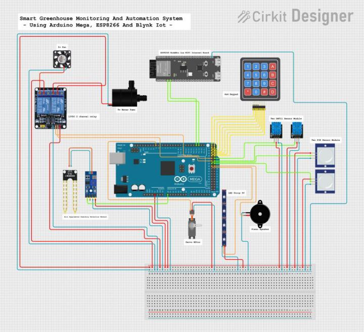
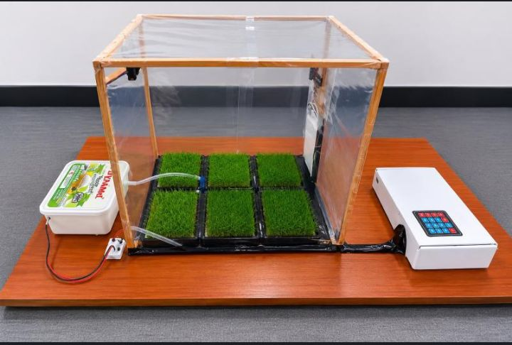

 

## Project Overview

An IoT-based Smart Greenhouse Monitoring and Automation System developed using Arduino Mega 2560 and ESP8266.

The system monitors temperature, soil moisture, and motion while automatically controlling watering, ventilation, lighting, and door access.

## Features

- Temperature monitoring
- Soil moisture monitoring
- Motion detection
- Automatic watering
- Automatic ventilation
- Automatic lighting
- Door access control
- Real-time monitoring using Blynk IoT

## Technologies Used

- Arduino Mega 2560
- ESP8266
- Blynk IoT
- Sensors
- Embedded C/C++

## Project Images

### Circuit Design

### Greenhouse Setup

